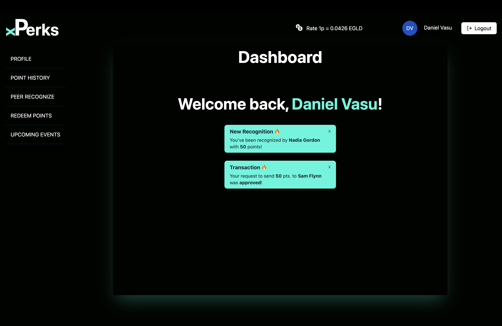
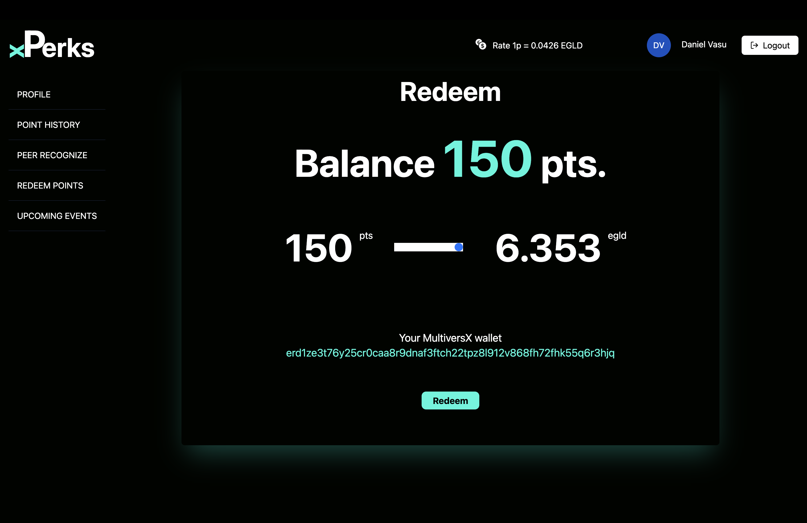

# xPerks - great things to the experts

xPerks takes the battle for brains at a whole new level.  

Recognition is made easy with xPerks. Developers & experts are motivated to keep on building, knowing that their efforts can be clearly seen & acknowledged.

## Summary
Connections between companies & experts are facilitated by xPerks. Grooming performance is the heart of sharing recongnition thorught perks.

Adoption is seamless, xPerks can be integrated with any company's account. 
Then, link with personal MultiversX wallet is one click away.

This approach opens a two-steps roadmap of xPerks:

	Step 1 -> 1 to X - where xPerks is provided as SaaS  with focus on recognition & retention for the experts. This will lead to bulk attrition of users.

	Step 2 -> X to X - where xPerks is available as connecting platform for any experts to many companies. 
	

As Perks  tend to align at the fastest rate ever seen, xPerks takes the battle for brains at a new level.  

Step 2 is where the game is changing:
Multi-platform user access with metrics & scores available for both experts & companies. 

This will open a world of possibilities  - will connect business & experts a whole new level using the blockchain as base layer for recognition & attrition.

Link with personal wallet is one click away - it eases scaling & integration - it's worth saying it twice.

There's also a shade of gamification to this approach too. 
Any company internal benefits can be translated in actions & points with xPerks. 
These can then be either staked to win rewards, spent or swapped on any coin within MultiversX environment.
## Bussiness Case
###  Why?
Attrition & retention are a constant challenge on any high-tech company. 
Perks improve these metrics. They do reinforce & sterngthen company culture.
Leveling of perks happens at the fastest rate ever thus pressue on keeping brains engaged remains high.

Short answer: Leverage in Battle for Brains.

###  What?
xPerks is available as a solution rewrite the way company - employee relationship is handled in terms of building trust & fostering long term relationship. This is Step 1 which is focused on getting companies onboard - leveraging the already available databases of companies + the Single Sign-On solution. Adoption of experts will happen in-bulk during this step.

For the Step 2 xPerks will evolve to a platform interconnecting compaies and experts in an X to X fashion. This is where focus will be on transparency and loiailty recognition will play a pivotal point.

Short answer: xPerks platform that runs blockchain -> endless customization + a shade of gamification.

###  How?
Answer is one click away - xPerks creates means of sharing recognition thorugh either top-down, peer2peer or reaching goals. Perks will be aligned with companies in Step1. While starting with convertible tokens, introducing NFTs will make customization possibilities endless.

Short answer: SSO for experts, blockchian config for companies, transparency for both

## Roadmap
Oct  2023: v0.1 top-down recognition features demo + blockchain connection on testnet

Dec  2023: v0.2 P2P recognition features added; top-down recognition included in smartcontract on testnet

Feb  2024: v1.0 top-down, P2P in smartcontract on main net

May  2024: V1.1 UI/UX overhaul, baseline of selectable perks available on mainnet

Aug  2024: V2.0 XtoX available

Sept 2024: mobile app available

## Cold Demo

Below chain of snips is intended to showcase the basic steps while using xPerks:

- Log in screen:

- Welcome dashboard:

- Personal profile:

- Points History (Manager View):

- Recognition as Action (Manager View):

- Acceptance of Recognition (Expert View):

- Perks Approvals View:

## Authors

Made with &#9829; by xPerks Team.

Naomi Vasu   - Software Engineer handling back-end architecture

Daniel Vasu  - Firmware Engineer providing front-end solution

Iulian Neagu - Project Manager creating the concept   